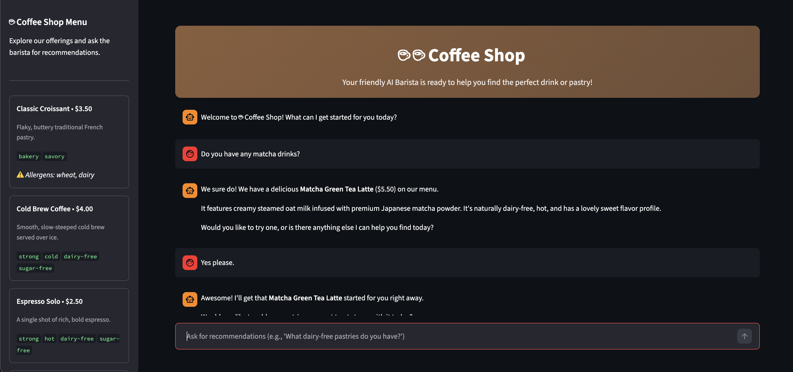
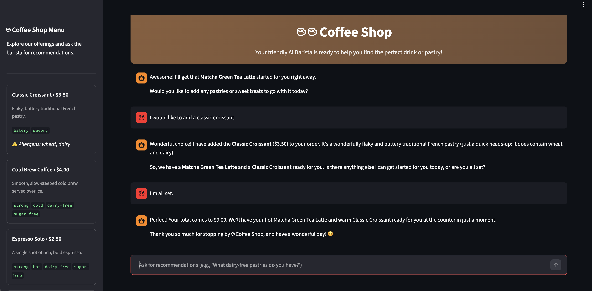

# RAG AI Agent with Google ADK and Cloud Run

RAG-based conversational agent built with **Google ADK, Gemini, Firestore Vector Search, Streamlit, and Cloud Run**.

The agent retrieves relevant menu items from Firestore using semantic vector search and uses them to generate grounded recommendations.

## Demo





## Stack

- Python
- Google Agent Development Kit (ADK)
- Gemini
- Firestore Vector Search
- Google GenAI SDK
- Streamlit
- Google Cloud Run

## Architecture

```text
User
  ↓
Streamlit
  ↓
Google ADK Agent
  ↓
get_menu() tool
  ↓
Embedding
  ↓
Firestore Vector Search
  ↓
Relevant results
  ↓
Gemini response
```

## Key Features

- ADK agent with custom tool calling
- Retrieval-Augmented Generation
- Semantic search with vector embeddings
- Firestore-backed dynamic knowledge base
- Grounded recommendations
- Cloud Run deployment
- Dedicated IAM service account

## Project Structure

```text
.
├── agent.py
├── app.py
├── menu.json
├── seed.py
├── requirements.txt
└── assets/
```

## Retrieval

Menu items are embedded and stored in Firestore.

At query time, the application:

```text
query → embedding → cosine similarity search → top 3 results → agent
```

This allows the knowledge base to be updated without redeploying the application.

## Deployment

Deployed from source to Google Cloud Run using Google Cloud Buildpacks.

```bash
gcloud run deploy coffee-barista \
  --source . \
  --region $REGION \
  --allow-unauthenticated
```

## Notes

Conversation state is currently stored in Streamlit `session_state` and is not persistent across sessions.

Based on a Google Cloud codelab, extended with Firestore Vector Search.
